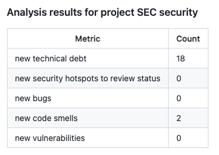

# sonar-analysis-results-action

This action asks for the last review in a sonarqube server, parses the result and publishes them i the pull request where it's executed.

By default it pushes a comment with the following format:



The sonarqube query asks for the following metrics: `new_technical_debt`,`new_security_hotspots_to_review_status`, `new_bugs`, `new_code_smells`, `new_vulnerabilities`

## Inputs

## GITHUB_TOKEN

Github authentication token

## SONAR_HOST

Sonarqube host FQDN / IP, it should be https.

## SONAR_TOKEN

Sonarqube authorization token generated from the Sonarqube server

## SONAR_PROJECT_KEY

Sonarqube project key used to retrieve the results.

## Example usage

```yaml
uses: actions/hello-world-javascript-action@e76147da8e5c81eaf017dede5645551d4b94427b
with:
  who-to-greet: "Mona the Octocat"
```
